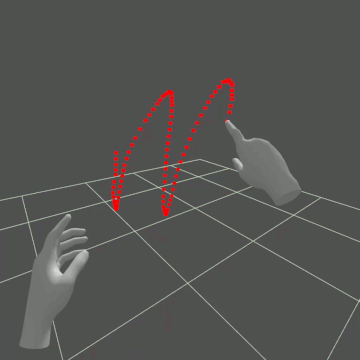
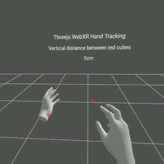

# Threejs-VR-Hand-Input
Explore Threejs VR hand input

## System Requirements

Oculus Quest (tested Quest 1, no controllers) 

Oculus Browser >15.4 (Quest update 29.0) 

Not sure if Oculus Browser needs to be configured for WebXR like in the early days. If examples do not work, type "chrome://flags" in Oculus Browser and search for "webxr". "WebXR experiences with hand and joints tracking" and "WebXR Layers" are enabled. 

Threejs-VR-Hand-Input uses a subset of three.js r129 to start VR with hand and joints tracking. 

Important - Javascript codes for this project are dependent on "WebXR Hand Input Module - Level 1", as of today, is an unstable API (https://www.w3.org/TR/webxr-hand-input-1/). Codes may stop working after Oculus Browser or threejs update. Oculus' experimental WebXR hand tracking release in February 2020 and three.js support have been fantastic with. 

## 1. Minimal Threejs VR Hand Input 

Open Oculus Browser to link and "Enter VR" with index finger-thumb click. No controllers as the codes are hand tracking only. 

[https://physicslibrary.github.io/Threejs-VR-Hand-Input/examples/threejs_vr_hand-input.html](https://physicslibrary.github.io/Threejs-VR-Hand-Input/examples/threejs_vr_hand_input.html)

## 2. Threejs VR Hand Input Palm-Up Gesture 

An example of left palm-up to make a box visible (open a menus or change variables). Distance between red cubes' y-positions decides when the palm is facing up. 

## Credits

https://threejs.org/
